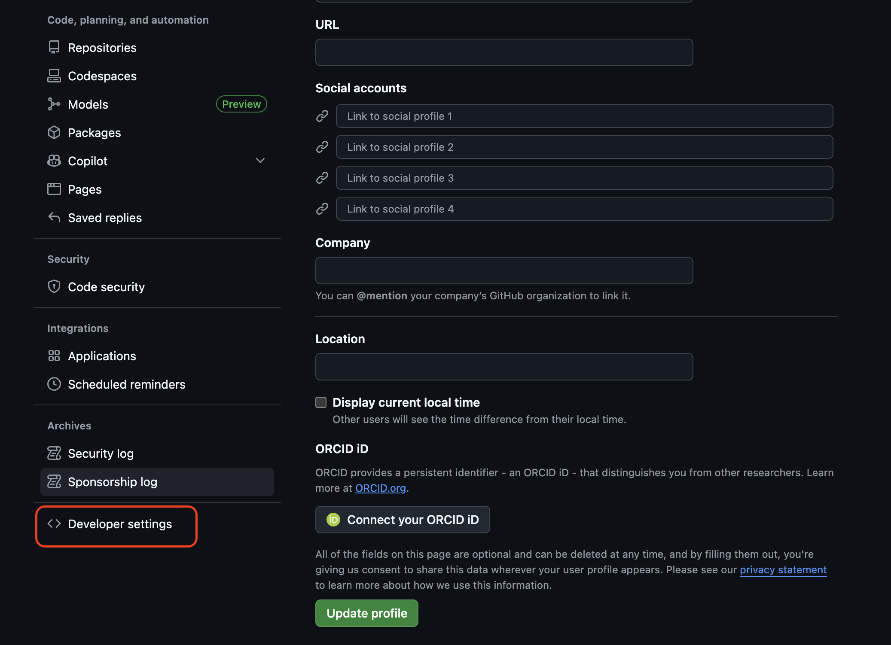
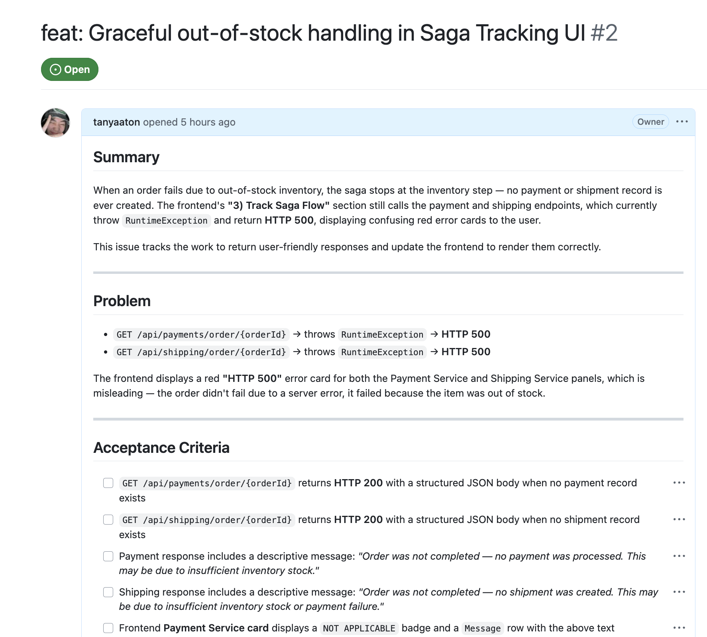
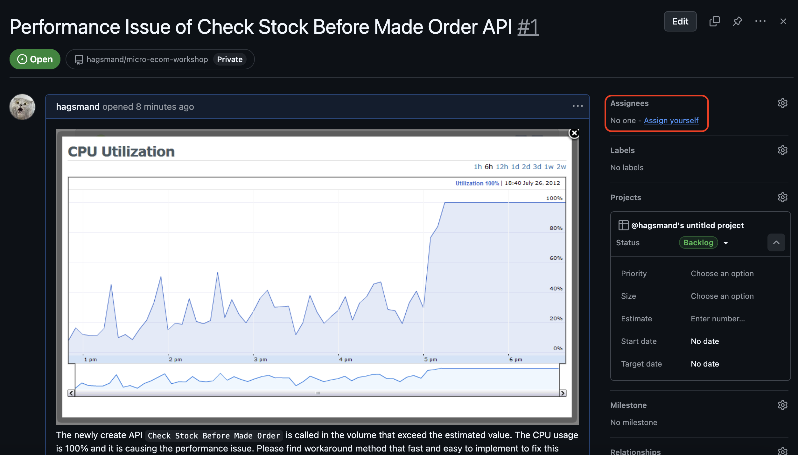

## Step 0: Setup Project
1. Clone this repository.
2. Publish it as new repo from your laptop using your **private** github account.
3. Download podman from `https://podman.io/`. If you don't have.
4. Go to settings of podman and setup podman machine to have at least 4 CPUs and 8 GB RAM.
5. Run compose command as below
```
cd ecommerce-microservices
podman compose -f podman-compose.yml up --build -d
```
6. Go to your browser and access to Eureka at `http://localhost:8761` to check if all services are up and running.

## Step 1: Setup Git MCP connection
1. Go to Github website of your personal account and go to settings menu as shown in the image below.


2. Click on `Developer settings` and then `Personal access tokens`.


3. Click on `Tokens (classic)` and then `Generate new token` and then `Generate token classic` to get your personal access token. Verify your identity.


4. Tick all the scope on the screen to give all permission to your token. Then click on `Generate token` button.


5. You will have something like image below. Copy the token and save it in a safe place.


6. Go back to Bob and click on settings menu. Go on MCP menu. Then click on `Open` of Global settings.


7. Paste the snippet below by replacing your Github token first. Then save the json MCP file that you edited. 

```
"github": {
      "command": "podman",
      "args": [
        "run",
        "-i",
        "--rm",
        "-e",
        "GITHUB_PERSONAL_ACCESS_TOKEN",
        "-e",
        "GITHUB_TOOLSETS",
        "-e",
        "GITHUB_READ_ONLY",
        "-e",
        "GITHUB_HOST",
        "ghcr.io/github/github-mcp-server"
      ],
      "env": {
        "GITHUB_PERSONAL_ACCESS_TOKEN": "<your personal access token>",
        "GITHUB_TOOLSETS": "",
        "GITHUB_READ_ONLY": "",
        "GITHUB_HOST": "https://github.com"
      }
    }
```
8. Select Bob's Advanced Mode and ask "do you have access to github mcp?".

## Step 1: Setup project
1. Go to Github menu and click create project as shown in image below.


2. Click green button `New Project`
3. Select `Kanban` template.
4. Tick `Import items from repository` and select repository you created in step 0.
5. If you see the Kanban board, you are good to go for this step.

## Step 2: Update API Service

### 2.1 Review the GitHub Issue

Check the GitHub UI — there is an open issue titled **`feat: Graceful out-of-stock handling in Saga Tracking UI`**. In this step, you will let Bob fix that issue.



### 2.2 Ask Bob to Fix the Issue

Send the following message to Bob:

> There are new GitHub issues created on this project. Pull that issue, understand it, and make changes to the code according to the criteria and information in the issue. Access the issue using the existing GitHub MCP.

### 2.3 Update the Documentation

After Bob applies the fix, send this follow-up message:

> Please also update the README and other related documentation and visualization according to the change you just made.


## Step 3: Fix performance issue of created API
1. Create an issue in Backlog by clicking `+ Add Item` button.
2. Type `Performance Issue of Shipping API` and click `Create new issue` then click `Blank issue`.
3. Upload the image from path `get_start_assets/project_setup/example_graph.png` into the issue page.
4. Copy below description and paste it to the issue page too.
```
The API on Shipping Service is called in the volume that exceed the estimated value. The CPU usage is 100% and it is causing the performance issue. Please find workaround method that fast and easy to implement to fix this issue as soon as possible.
```
5. Click create issue then click into that issue and click `Assign yourself`.

6. Come back to Bob and switch to Advanced Mode then ask `Is there any issue assign to me?`
7. The answer should include the issue we just created. Now, ask Bob `Help me fix the performance issue now`.
8. Bob will create task and start fixing. Here ask Bob to edit frontend that allow us to see that the cache is working by `Edit the frontend to show the cache is working`.
9. In case you face any issue go to Bob's chat and type `@terminal fix this error` and run compose up again. Remember services will not up immediately please wait a while and check on Eureka and see if the service is up and running couple times.
10. If everything is working fine, ask Bob `/create-pr and update issue status to done` by selected main branch as our target.
11. Bob should create PR and update issue status to done. That's it.


## Appendix
# Accessing Services
- **Frontend**: http://localhost:3000
- **API Gateway**: http://localhost:8080
- **Service Registry (Eureka)**: http://localhost:8761
- **Order Service**: http://localhost:8081
- **Inventory Service**: http://localhost:8082
- **Payment Service**: http://localhost:8083
- **Notification Service**: http://localhost:8084
- **Shipping Service**: http://localhost:8085

# Recommended resources:
- Memory: 8GB (8192MB) - Minimum for all services
- CPUs: 4-6 - For better performance
- Disk: 100GB - Already configured

# Fix command 
cd ecommerce-microservices
podman compose -f podman-compose.yml down
podman machine stop
podman machine rm
podman machine init --cpus 4 --memory 8192 --disk-size 100
podman machine start
