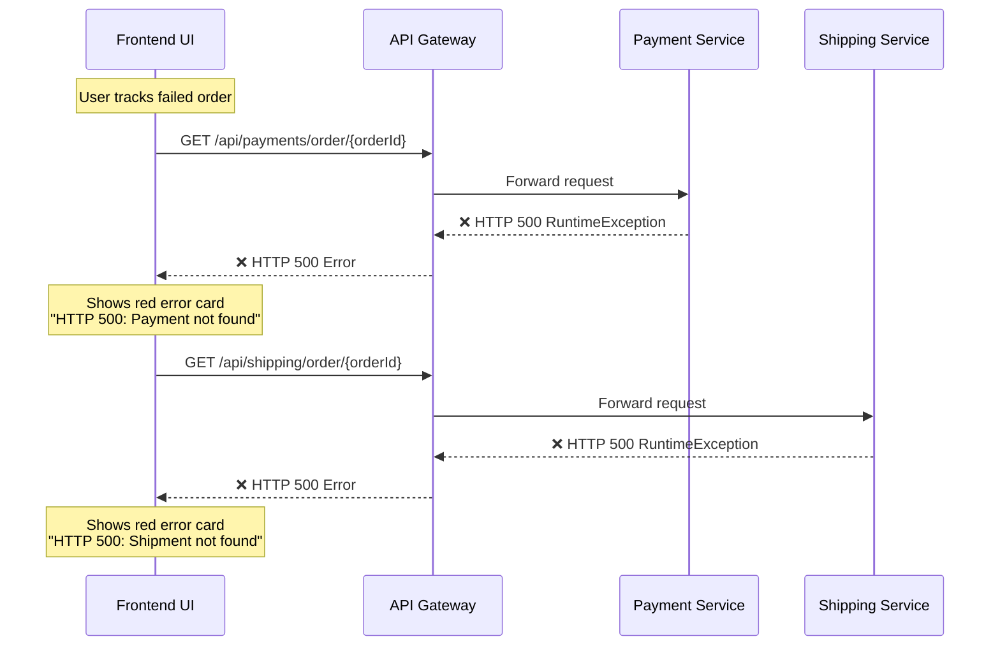
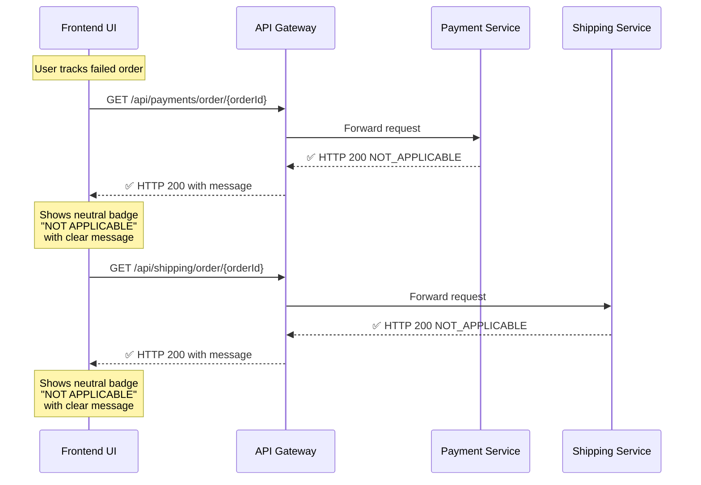
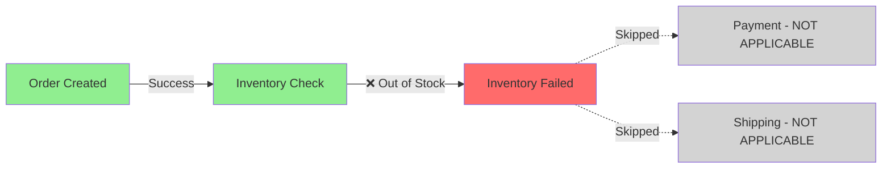

# Graceful Out-of-Stock Handling Implementation

## Overview

This document describes the implementation of graceful handling for out-of-stock scenarios in the Saga Tracking UI, addressing GitHub Issue #4.

## Visual Flow Diagram

### Before Implementation (HTTP 500 Errors)



### After Implementation (Graceful Handling)



### Saga Lane Visualization



## Problem Statement

When an order fails due to out-of-stock inventory, the saga stops at the inventory step. No payment or shipment record is created. Previously, the frontend's "Track Saga Flow" section would call the payment and shipping endpoints, which threw `RuntimeException` and returned HTTP 500 errors, displaying confusing red error cards to users.

## Solution

The solution implements graceful error handling by returning HTTP 200 responses with structured JSON payloads indicating that payment/shipping are "NOT_APPLICABLE" when no records exist, rather than throwing exceptions.

## Implementation Details

### Backend Changes

#### 1. Payment Service

**New DTO: `PaymentNotApplicableResponse.java`**
- Location: `payment-service/src/main/java/com/hacisimsek/payment/dto/PaymentNotApplicableResponse.java`
- Fields:
  - `status`: "NOT_APPLICABLE"
  - `message`: Descriptive message explaining why no payment exists
  - `orderId`: The order ID that was queried

**Updated Controller: `PaymentController.java`**
- Modified `getPaymentByOrderId()` method to catch `RuntimeException`
- Returns HTTP 200 with `PaymentNotApplicableResponse` when payment not found
- Message: "Order was not completed — no payment was processed. This may be due to insufficient inventory stock."

#### 2. Shipping Service

**New DTO: `ShipmentNotApplicableResponse.java`**
- Location: `shipping-service/src/main/java/com/hacisimsek/shipping/dto/ShipmentNotApplicableResponse.java`
- Fields:
  - `status`: "NOT_APPLICABLE"
  - `message`: Descriptive message explaining why no shipment exists
  - `orderId`: The order ID that was queried

**Updated Controller: `ShippingController.java`**
- Modified `getShipmentByOrderId()` method to catch `RuntimeException`
- Returns HTTP 200 with `ShipmentNotApplicableResponse` when shipment not found
- Message: "Order was not completed — no shipment was created. This may be due to insufficient inventory stock or payment failure."

### Frontend Changes

#### Updated Functions in `app.js`

**1. `renderPaymentCard()` Function**
- Added detection for `status === "NOT_APPLICABLE"`
- Renders a special card with:
  - "Payment Service" header
  - "NOT APPLICABLE" badge with neutral styling
  - Order ID
  - Descriptive message from the response

**2. `renderShippingCard()` Function**
- Added detection for `status === "NOT_APPLICABLE"`
- Renders a special card with:
  - "Shipping Service" header
  - "NOT APPLICABLE" badge with neutral styling
  - Order ID
  - Descriptive message from the response

**3. `updateSagaLane()` Function**
- Enhanced to detect NOT_APPLICABLE status for payment and shipping
- Updated inventory node to show "error" state with "Reservation failed" for FAILED/CANCELLED orders
- Updated payment node to show "neutral" state with "Skipped — order not completed" when NOT_APPLICABLE
- Updated shipping node to show "neutral" state with "Skipped — order not completed" when NOT_APPLICABLE
- Improved logic to handle various failure scenarios consistently

## User Experience Improvements

### Before
- ❌ HTTP 500 error cards for Payment Service
- ❌ HTTP 500 error cards for Shipping Service
- ❌ Confusing error messages suggesting server failures
- ❌ Red error indicators throughout the UI

### After
- ✅ HTTP 200 responses with structured data
- ✅ "NOT APPLICABLE" badges with neutral styling
- ✅ Clear, user-friendly messages explaining the situation
- ✅ Saga lane shows:
  - Red/error state for inventory (where the actual failure occurred)
  - Neutral/grey state for payment (skipped)
  - Neutral/grey state for shipping (skipped)
- ✅ No HTTP error codes for expected business scenarios

## Acceptance Criteria Status

- ✅ `GET /api/payments/order/{orderId}` returns HTTP 200 with structured JSON when no payment exists
- ✅ `GET /api/shipping/order/{orderId}` returns HTTP 200 with structured JSON when no shipment exists
- ✅ Payment response includes descriptive message about insufficient inventory
- ✅ Shipping response includes descriptive message about insufficient inventory or payment failure
- ✅ Frontend Payment Service card displays "NOT APPLICABLE" badge and message
- ✅ Frontend Shipping Service card displays "NOT APPLICABLE" badge and message
- ✅ Both cards are visually consistent
- ✅ Saga lane Inventory node shows error state for reservation failure
- ✅ Saga lane Payment node shows neutral state with "Skipped — order not completed"
- ✅ Saga lane Shipping node shows neutral state with "Skipped — order not completed"
- ✅ No red HTTP error cards appear for out-of-stock scenario
- ✅ No HTTP 4xx or 5xx codes returned for out-of-stock scenario

## Testing Recommendations

### Manual Testing Steps

1. **Create an order with insufficient inventory:**
   - Add an inventory item with quantity 1
   - Create an order requesting quantity 2
   - Order should fail at inventory reservation

2. **Track the saga flow:**
   - Use the "Track Saga Flow" section
   - Enter the failed order ID
   - Click "Track Saga"

3. **Verify the results:**
   - Order Service card should show FAILED or CANCELLED status
   - Payment Service card should show "NOT APPLICABLE" badge with message
   - Shipping Service card should show "NOT APPLICABLE" badge with message
   - Saga lane should show:
     - Order node: appropriate status
     - Inventory node: red/error with "Reservation failed"
     - Payment node: grey/neutral with "Skipped — order not completed"
     - Shipping node: grey/neutral with "Skipped — order not completed"
   - No HTTP 500 errors should appear

### API Testing

**Test Payment Endpoint:**
```bash
# For an order that failed at inventory
curl -X GET http://localhost:8080/gateway/api/payments/order/{orderId}

# Expected Response (HTTP 200):
{
  "status": "NOT_APPLICABLE",
  "message": "Order was not completed — no payment was processed. This may be due to insufficient inventory stock.",
  "orderId": "{orderId}"
}
```

**Test Shipping Endpoint:**
```bash
# For an order that failed at inventory
curl -X GET http://localhost:8080/gateway/api/shipping/order/{orderId}

# Expected Response (HTTP 200):
{
  "status": "NOT_APPLICABLE",
  "message": "Order was not completed — no shipment was created. This may be due to insufficient inventory stock or payment failure.",
  "orderId": "{orderId}"
}
```

## Files Modified

### Backend
1. `payment-service/src/main/java/com/hacisimsek/payment/dto/PaymentNotApplicableResponse.java` (new)
2. `payment-service/src/main/java/com/hacisimsek/payment/controller/PaymentController.java` (modified)
3. `shipping-service/src/main/java/com/hacisimsek/shipping/dto/ShipmentNotApplicableResponse.java` (new)
4. `shipping-service/src/main/java/com/hacisimsek/shipping/controller/ShippingController.java` (modified)

### Frontend
1. `mvp-frontend/app.js` (modified)
   - `renderPaymentCard()` function
   - `renderShippingCard()` function
   - `updateSagaLane()` function

## Design Decisions

### Why HTTP 200 Instead of 404?

The decision to return HTTP 200 instead of 404 was made because:
1. The absence of a payment/shipment record is an **expected business outcome**, not an error
2. The API successfully processed the request and returned meaningful information
3. HTTP 200 prevents error handling code from treating this as a failure
4. It aligns with the principle that HTTP status codes should reflect transport/protocol success, not business logic outcomes

### Why NOT_APPLICABLE Status?

The "NOT_APPLICABLE" status clearly communicates that:
1. The service is functioning correctly
2. The operation was not performed due to business rules
3. This is different from "PENDING" (waiting) or "FAILED" (attempted but unsuccessful)
4. It's a neutral state that doesn't imply system failure

## Future Enhancements

Potential improvements for future iterations:

1. **Enhanced Error Context**: Include more details about why the order failed (e.g., specific inventory shortage amount)
2. **Retry Suggestions**: Provide actionable suggestions to users (e.g., "Reduce quantity to X to proceed")
3. **Compensation Tracking**: Show compensation events in the saga lane
4. **Historical State**: Display the progression of states over time
5. **Real-time Updates**: Use WebSocket or SSE to update the UI as saga events occur

## Related Documentation

- GitHub Issue #4: "Graceful out-of-stock handling in Saga Tracking UI"
- Saga Pattern Documentation
- API Gateway Configuration
- Frontend Architecture Guide

## Conclusion

This implementation successfully addresses the user experience issues when orders fail due to inventory constraints. By returning structured, meaningful responses instead of generic errors, users can now understand exactly what happened and why certain services were not invoked.