# E-commerce Microservices with Saga Pattern


A professional implementation of an e-commerce system using microservice architecture with Saga pattern for distributed transaction management.

*Created by: hacisimsek*  
*Last Updated: 2025-05-26 18:40:03*

## Table of Contents

- [Overview](#overview)
- [Architecture](#architecture)
- [Microservices](#microservices)
- [Technologies](#technologies)
- [Saga Pattern Implementation](#saga-pattern-implementation)
- [Project Structure](#project-structure)
- [Setup Instructions](#setup-instructions)
- [API Documentation](#api-documentation)
- [Testing](#testing)
- [Contributing](#contributing)

## Overview

This project implements a robust e-commerce system using a microservices architecture. The system handles order processing, inventory management, payment processing, shipping logistics, and customer notifications while maintaining data consistency across distributed services through the Saga pattern.

## Architecture

### High-Level System Architecture

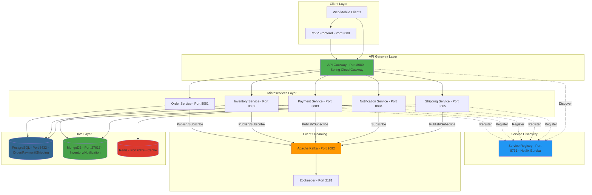

### Microservices Communication Pattern

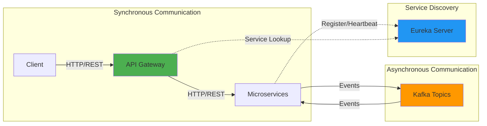

## Microservices

1. **Order Service**:
    - Manages order creation and lifecycle
    - Initiates the order saga process
    - Tracks order status throughout the saga

2. **Inventory Service**:
    - Manages product inventory
    - Handles inventory reservation during order processing
    - Provides inventory availability checks

3. **Payment Service**:
    - Processes customer payments
    - Manages payment refunds for compensation transactions
    - Tracks payment status

4. **Shipping Service**:
    - Creates shipments for orders
    - Generates tracking information
    - Manages delivery status

5. **Notification Service**:
    - Sends notifications to customers
    - Supports multiple notification channels
    - Tracks notification delivery status

6. **Infrastructure Services**:
    - **Service Registry**: Service discovery with Eureka
    - **API Gateway**: Routing and cross-cutting concerns

## Technologies

- **Java 17**: Core programming language
- **Spring Boot 3.2.12**: Application framework
- **Spring Cloud**: Microservices toolkit
- **Apache Kafka**: Event streaming platform for service communication
- **Databases**:
    - **PostgreSQL**: For Order, Payment, and Shipping services
    - **MongoDB**: For Inventory and Notification services
    - **Redis**: For caching and temporary data storage
- **Docker & Docker Compose**: Containerization and orchestration
- **Maven**: Build and dependency management

## Saga Pattern Implementation

This project implements the **Choreography-based Saga Pattern** for distributed transaction management across microservices.

### Saga Pattern Overview

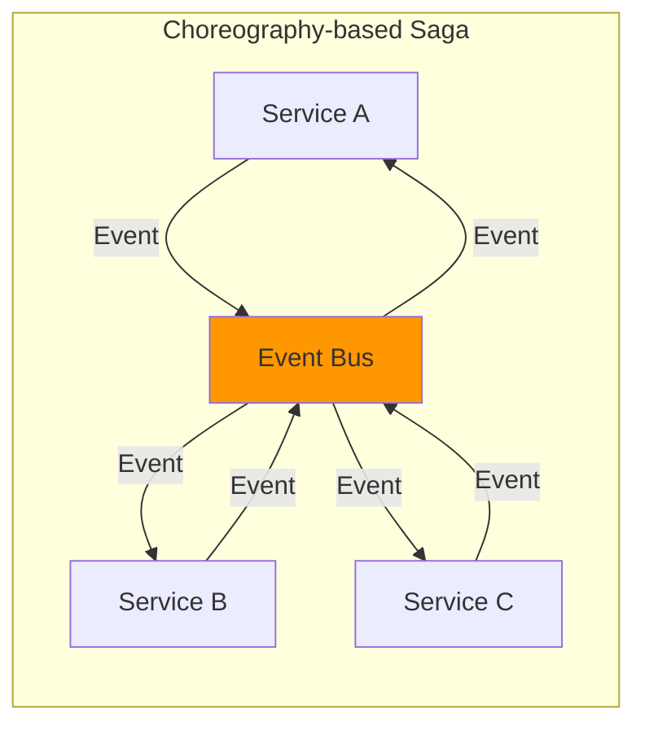

### Complete Order Processing Saga Flow

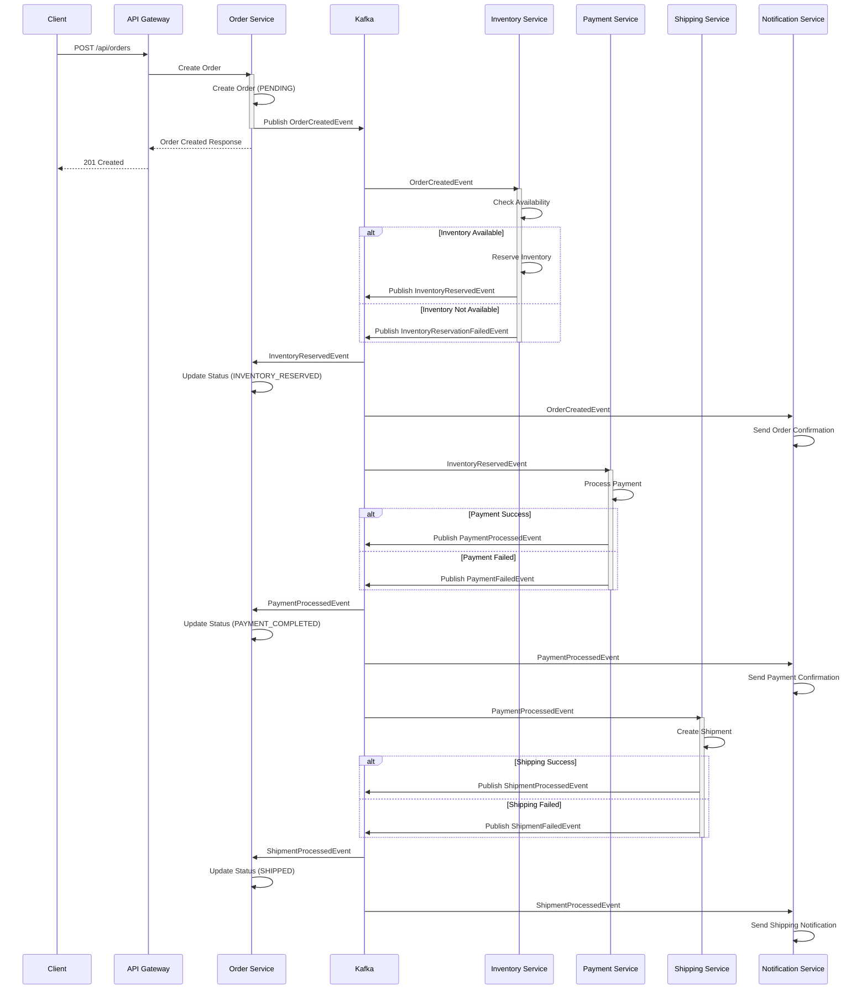

### Saga Compensation Flow (Failure Scenario)

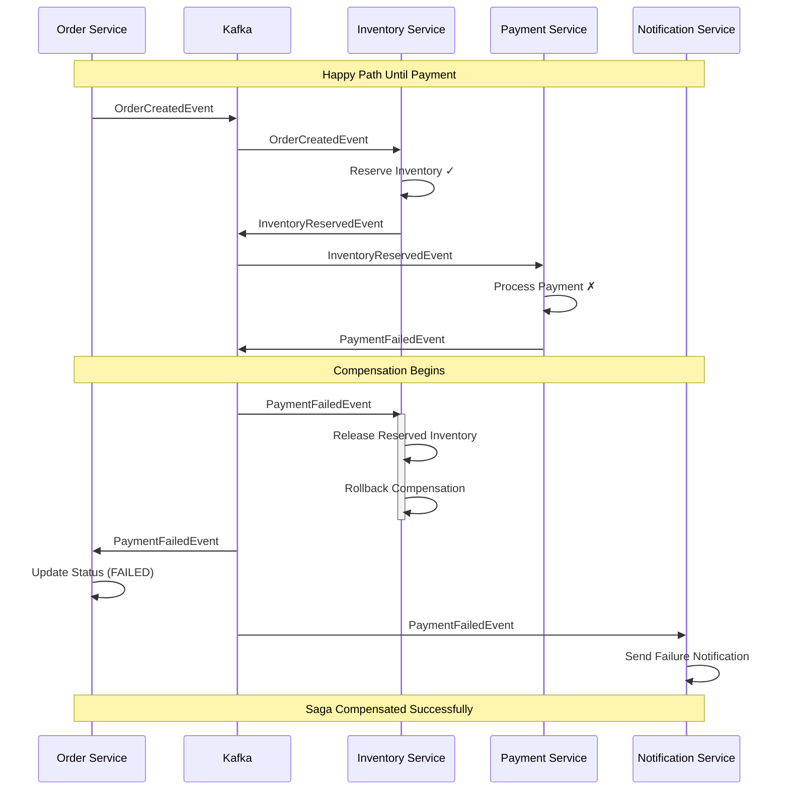

### Order Status State Machine

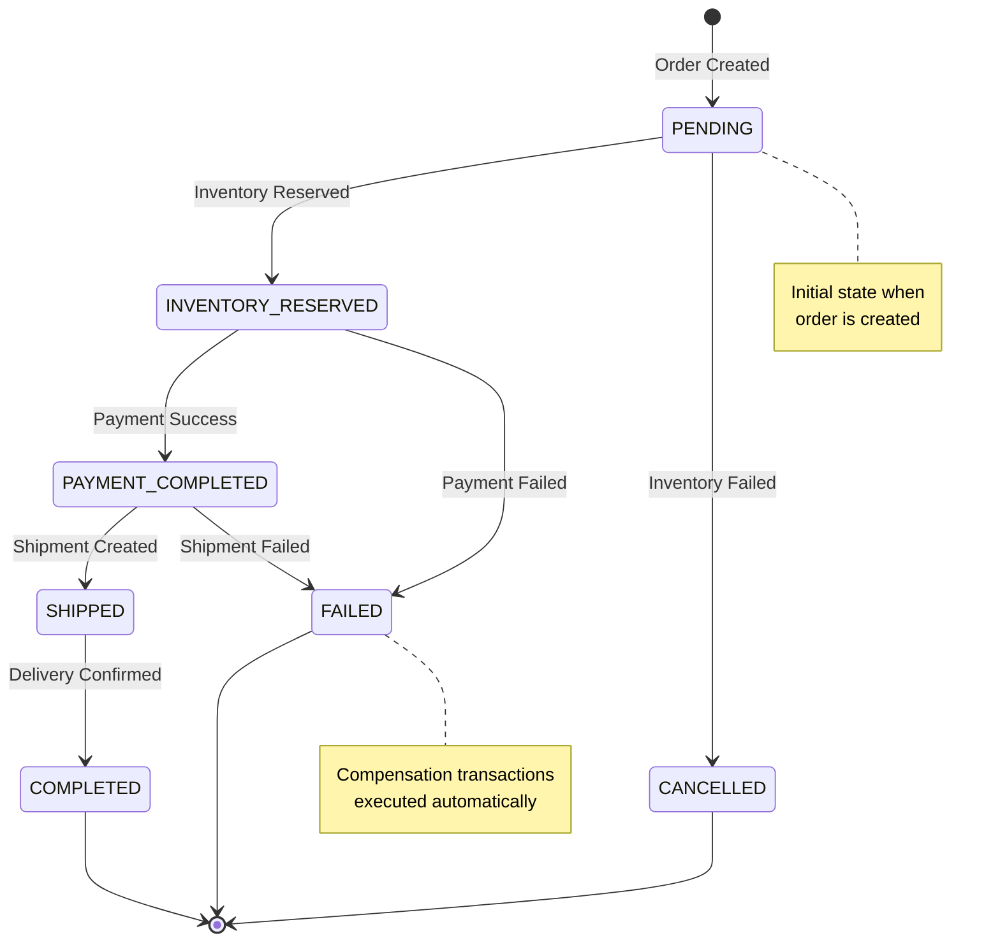

### Kafka Topics and Event Flow

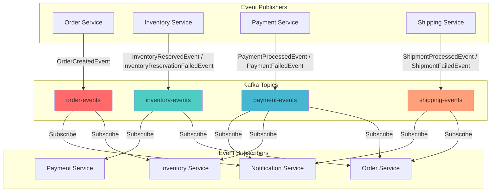

### Event-Driven Architecture Details

#### Event Types and Handlers

| Service | Publishes | Subscribes To | Compensation Action |
|---------|-----------|---------------|---------------------|
| **Order Service** | `OrderCreatedEvent` | `InventoryReservedEvent`<br/>`InventoryReservationFailedEvent`<br/>`PaymentProcessedEvent`<br/>`PaymentFailedEvent`<br/>`ShipmentProcessedEvent`<br/>`ShipmentFailedEvent` | Update order status |
| **Inventory Service** | `InventoryReservedEvent`<br/>`InventoryReservationFailedEvent` | `OrderCreatedEvent`<br/>`PaymentFailedEvent` | Release reserved inventory |
| **Payment Service** | `PaymentProcessedEvent`<br/>`PaymentFailedEvent` | `InventoryReservedEvent` | Refund payment (if needed) |
| **Shipping Service** | `ShipmentProcessedEvent`<br/>`ShipmentFailedEvent` | `PaymentProcessedEvent` | Cancel shipment |
| **Notification Service** | None | `OrderCreatedEvent`<br/>`PaymentProcessedEvent`<br/>`PaymentFailedEvent`<br/>`ShipmentProcessedEvent` | Send notifications |

### Saga Guarantees

1. **Atomicity**: Either all steps complete successfully, or compensating transactions restore the system to a consistent state
2. **Consistency**: Each service maintains its own data consistency
3. **Isolation**: Services operate independently without locking shared resources
4. **Durability**: Events are persisted in Kafka, ensuring no message loss

### Compensation Transaction Rules

- **Inventory Reservation Failure** → Order cancelled immediately
- **Payment Failure** → Inventory released, order marked as failed
- **Shipping Failure** → Payment refunded, inventory released, order marked as failed

## Code Architecture & Design Patterns

### Layered Architecture Overview

This project follows a **Layered Architecture** (also known as N-Tier Architecture) with **Domain-Driven Design (DDD)** principles, combined with **Event-Driven Architecture** for inter-service communication.

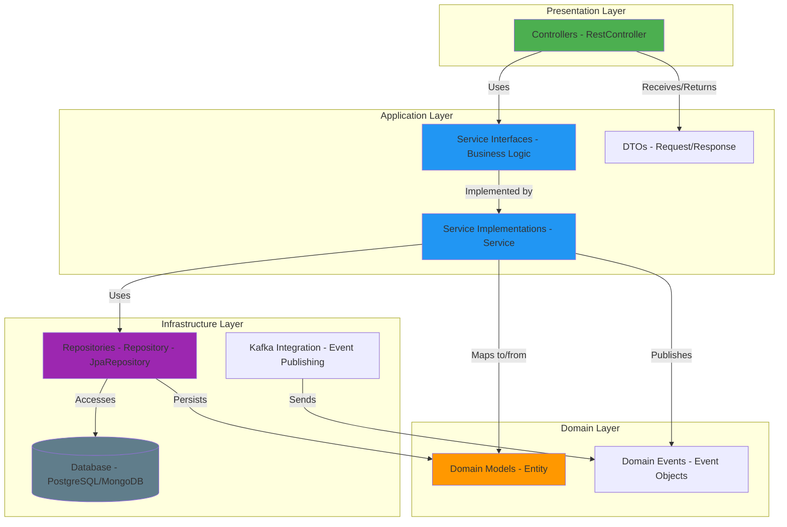

### Microservice Internal Architecture

Each microservice follows the same layered structure:

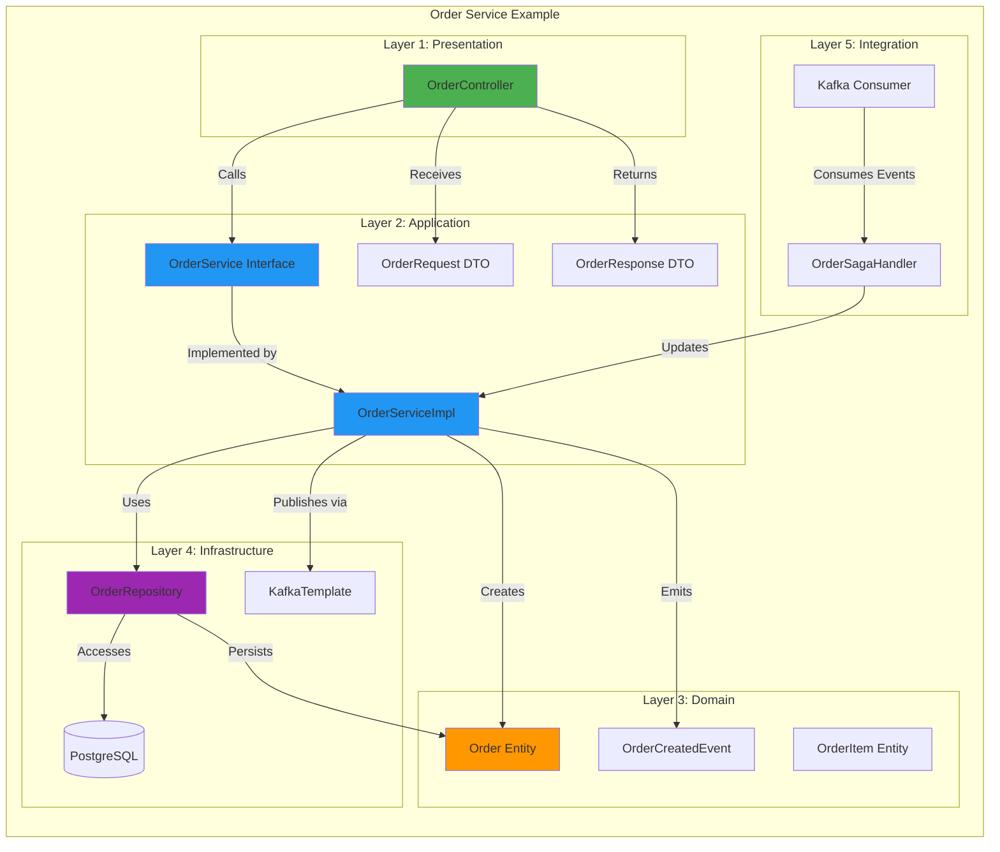

### Design Patterns Used

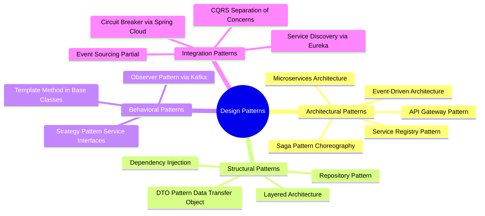

### Layer Responsibilities

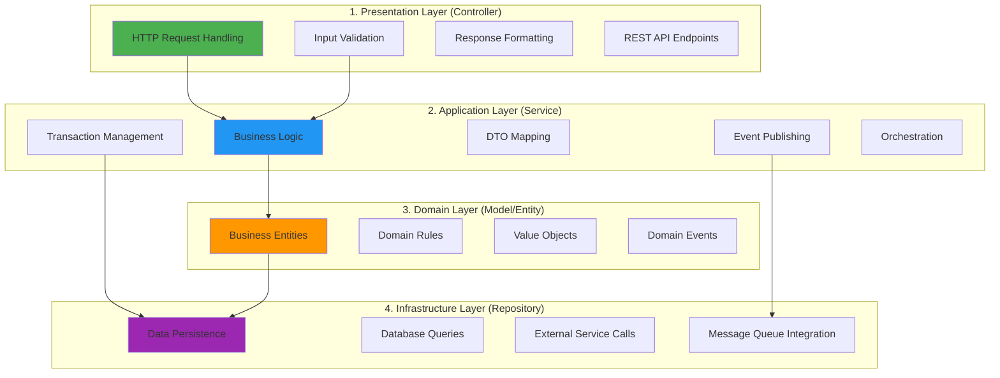

### Package Structure Pattern

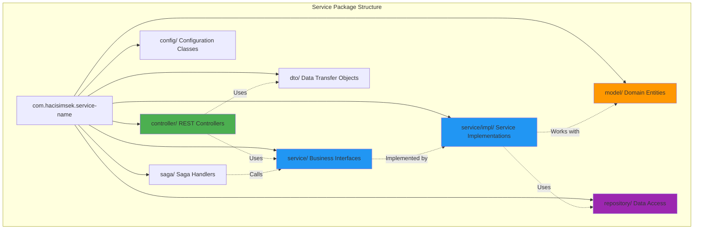

### Request Flow Pattern

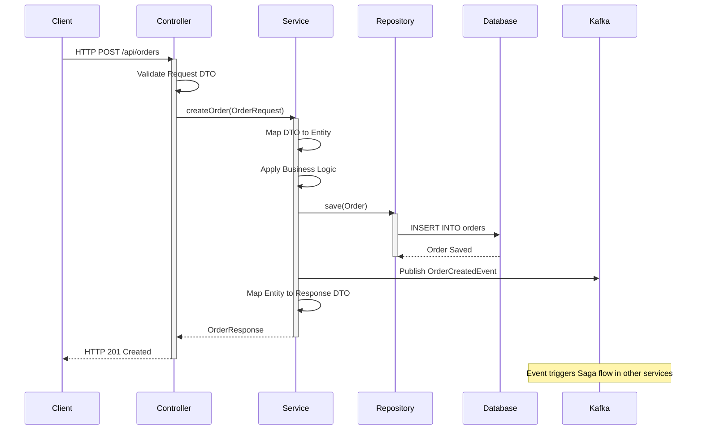

### Dependency Injection Pattern

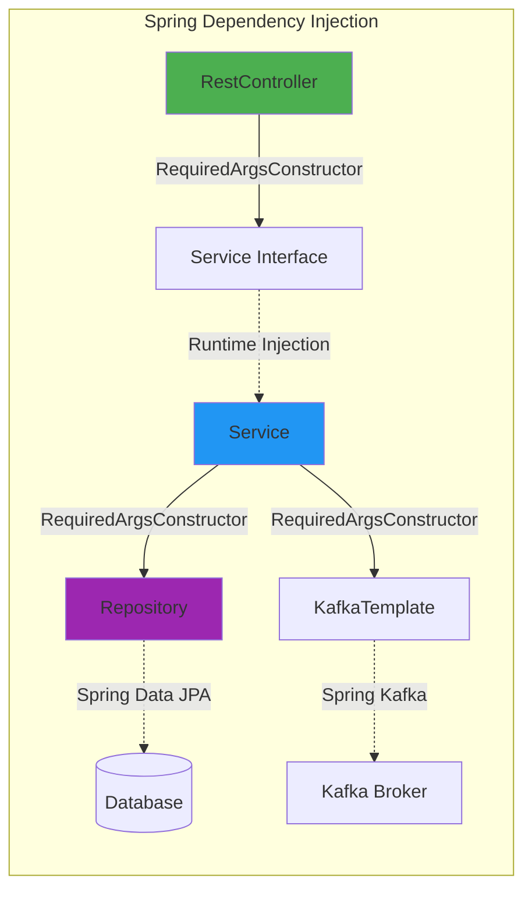

### Key Architectural Principles

1. **Separation of Concerns**: Each layer has a specific responsibility
2. **Dependency Inversion**: High-level modules don't depend on low-level modules
3. **Single Responsibility**: Each class has one reason to change
4. **Interface Segregation**: Service interfaces define contracts
5. **Open/Closed Principle**: Open for extension, closed for modification

### Pattern Comparison

| Pattern | Used In This Project | Purpose |
|---------|---------------------|---------|
| **MVC** | ❌ No | Web applications with views |
| **MVP** | ❌ No | UI-heavy applications |
| **Layered Architecture** | ✅ Yes | Separation of concerns in services |
| **Repository Pattern** | ✅ Yes | Data access abstraction |
| **DTO Pattern** | ✅ Yes | Data transfer between layers |
| **Saga Pattern** | ✅ Yes | Distributed transactions |
| **Event-Driven** | ✅ Yes | Asynchronous communication |
| **Domain-Driven Design** | ✅ Yes | Business logic organization |

- **All Failures** → Customer notified with appropriate message

## Project Structure

```
ecommerce-microservices/
├── pom.xml                          # Parent POM
├── common-library/                  # Shared code between services
├── service-registry/                # Eureka Service Discovery
├── api-gateway/                     # Spring Cloud Gateway
├── order-service/                   # Order management
├── inventory-service/               # Inventory management
├── payment-service/                 # Payment processing
├── notification-service/            # Notification handling
├── shipping-service/                # Shipping management
├── mvp-frontend/                    # Browser UI for MVP flow testing
└── docker-compose.yml               # Docker composition for all services
```

## Setup Instructions

### Prerequisites

- Java 17
- Maven 3.8+
- Podman with Compose support (or Docker)

#### Installing Java, Maven, and Gradle on Windows

**Using WinGet (Windows 11, recommended):**
```powershell
# Install Java (Eclipse Temurin)
winget install EclipseAdoptium.Temurin.21.JDK

# Install Maven
winget install Apache.Maven

# Install Gradle
winget install Gradle.Gradle

# Verify installations
java -version
mvn -version
gradle -version
```

**Using Scoop (Alternative):**
```powershell
# Install Scoop
Set-ExecutionPolicy RemoteSigned -Scope CurrentUser
irm get.scoop.sh | iex

# Add Java bucket
scoop bucket add java

# Install tools
scoop install temurin21-jdk
scoop install maven
scoop install gradle
```

**Using Chocolatey (Alternative):**
```powershell
# Install Chocolatey (as Administrator)
Set-ExecutionPolicy Bypass -Scope Process -Force
[System.Net.ServicePointManager]::SecurityProtocol = [System.Net.ServicePointManager]::SecurityProtocol -bor 3072
iex ((New-Object System.Net.WebClient).DownloadString('https://community.chocolatey.org/install.ps1'))

# Install tools
choco install temurin21
choco install maven
choco install gradle
```

### Installing Podman

#### macOS
```bash
# Install Podman
brew install podman

# Install Podman Desktop (GUI application)
brew install --cask podman-desktop

# Initialize and start Podman machine
podman machine init
podman machine start

# Verify installation
podman --version
podman compose version
```

#### Linux (Ubuntu/Debian)
```bash
# Install Podman
sudo apt-get update
sudo apt-get install -y podman

# Install Podman Compose
pip3 install podman-compose

# Verify installation
podman --version
podman-compose --version
```

#### Linux (Fedora/RHEL/CentOS)
```bash
# Install Podman (usually pre-installed)
sudo dnf install -y podman

# Install Podman Compose
pip3 install podman-compose

# Verify installation
podman --version
podman-compose --version
```

#### Windows
1. Download and install [Podman Desktop](https://podman-desktop.io/downloads)
2. Podman Desktop includes Podman and Compose support
3. Follow the installation wizard
4. Verify installation in PowerShell:
```powershell
podman --version
podman compose version
```

### Running the Application

#### Option 1: Using Podman Compose (Build from Source - Recommended)

This method builds all services from source code using Maven inside containers.

1. **Clone the repository**:
```bash
git clone https://github.com/hacisimsek/ecommerce-microservices.git
cd ecommerce-microservices
```

2. **Start all services** (builds and runs):
```bash
podman compose -f podman-compose.yml up --build -d
```

> This will:
> - Build all Maven projects from source inside containers
> - Create Docker images for each service
> - Start all infrastructure services (Kafka, PostgreSQL, MongoDB, Redis)
> - Start all microservices with proper dependencies
> - Start the frontend

3. **Check service status**:
```bash
podman compose -f podman-compose.yml ps
```

4. **View logs**:
```bash
# All services
podman compose -f podman-compose.yml logs -f

# Specific service
podman compose -f podman-compose.yml logs -f order-service
```

5. **Stop all services**:
```bash
podman compose -f podman-compose.yml down
```

6. **Stop and remove volumes**:
```bash
podman compose -f podman-compose.yml down -v
```

#### Option 2: Using Docker Compose (Pre-built JARs)

This method uses pre-built JAR files from your local Maven build.

1. **Clone the repository**:
```bash
git clone https://github.com/hacisimsek/ecommerce-microservices.git
cd ecommerce-microservices
```

2. **Build all jars**:
```bash
./mvnw -DskipTests clean package
```

3. **Start all services**:
```bash
docker compose up -d
```

> This uses the jar files generated by step 2 from each module's `target/` directory.

4. **Wait until the full stack is ready**:
```bash
./scripts/wait-for-stack-ready.sh
```

Expected success output:
```text
stack-ready
```

### Accessing Services

Once all services are running, you can access:

```bash
# Eureka Service Registry Dashboard
http://localhost:8761

# API Gateway Health Check
http://localhost:8080/actuator/health

# Kafka UI - Monitor Topics, Messages, and Consumers
http://localhost:8090

# pgAdmin - PostgreSQL Database Management
http://localhost:5050

# MVP Frontend Test Console
http://localhost:3000
```

### Kafka UI Features

The Kafka UI provides a web interface to monitor and manage Kafka:

- **Topics**: View all Kafka topics (order-events, inventory-events, payment-events, shipping-events)
- **Messages**: Browse and search messages in real-time
- **Consumers**: Monitor consumer groups and their lag
- **Brokers**: Check broker health and configuration
- **Schema Registry**: View message schemas (if configured)

**Useful for debugging:**
- See what events are being published
- Verify event payloads and structure
- Monitor consumer lag and processing
- Troubleshoot message delivery issues

### pgAdmin Features

pgAdmin provides a web-based PostgreSQL management interface:

**Login Credentials:**
- Email: `admin@admin.com`
- Password: `admin`

**First-time Setup:**
1. Access pgAdmin at `http://localhost:5050`
2. Login with the credentials above
3. Right-click "Servers" → "Register" → "Server"
4. Configure connection:
   - **General Tab:**
     - Name: `Ecommerce PostgreSQL`
   - **Connection Tab:**
     - Host: `postgres`
     - Port: `5432`
     - Username: `postgres`
     - Password: `postgres`
     - Save password: ✓
5. Click "Save"

**Available Databases:**
- `order_db` - Order Service data (orders, order_items)
- `payment_db` - Payment Service data (payments)
- `shipping_db` - Shipping Service data (shipments)

**Useful for debugging:**
- Query order data directly
- Check payment records
- Verify shipment creation
- Monitor database schema
- Execute SQL queries
- View table relationships

### MVP Frontend Console

The project includes a lightweight frontend app for manual end-to-end testing:

- URL: `http://localhost:3000`
- Backend proxy: `http://localhost:3000/gateway/*` -> `api-gateway:8080`
- Main capabilities:
  - Create and list inventory items
  - Create an order using inventory product IDs
  - Track order/payment/shipping/notification records in one screen
  - Check inventory availability

## Development Workflow

### Making Changes to a Service

When you modify code in any service (e.g., inventory-service):

#### Quick Rebuild and Restart
```bash
# Rebuild only the changed service
podman compose -f podman-compose.yml up --build --force-recreate inventory-service -d

# View logs
podman compose -f podman-compose.yml logs -f inventory-service
```

#### Run Tests Before Building
```bash
# One-time setup: Create Maven repository volume and build common-library
podman volume create maven-repo
podman run --rm -v $(pwd):/app -v maven-repo:/root/.m2 -w /app maven:3.9-eclipse-temurin-17 \
  bash -c "mvn -N install && mvn -f common-library/pom.xml clean install -DskipTests"

# Run unit tests for a specific service
podman run --rm -v $(pwd):/app -v maven-repo:/root/.m2 -w /app maven:3.9-eclipse-temurin-17 \
  mvn -f inventory-service/pom.xml test

# Run all tests
podman run --rm -v $(pwd):/app -v maven-repo:/root/.m2 -w /app maven:3.9-eclipse-temurin-17 \
  mvn test
```

#### Complete Development Cycle
```bash
# 1. Run tests (assumes common-library is already built in maven-repo volume)
podman run --rm -v $(pwd):/app -v maven-repo:/root/.m2 -w /app maven:3.9-eclipse-temurin-17 \
  mvn -f inventory-service/pom.xml clean test

# 2. If tests pass, rebuild and restart
podman compose -f podman-compose.yml up --build --force-recreate inventory-service -d

# 3. Verify the service
curl http://localhost:8082/actuator/health
```

**Note**: The `maven-repo` volume persists the Maven local repository, so you only need to build common-library once unless you modify it.

### Common Development Commands

```bash
# Rebuild specific service
podman compose -f podman-compose.yml up --build --force-recreate <service-name> -d

# View logs
podman compose -f podman-compose.yml logs -f <service-name>

# Restart without rebuilding
podman compose -f podman-compose.yml restart <service-name>

# Execute command in container
podman compose -f podman-compose.yml exec <service-name> bash

# Run integration tests
podman run --rm -v $(pwd):/app -w /app maven:3.9-eclipse-temurin-17 \
  mvn verify -P integration-test
```

For detailed development workflows, debugging, and best practices, see [PODMAN-COMPOSE-README.md](PODMAN-COMPOSE-README.md).

## API Documentation

### Order Service

#### Create an Order
```
POST /api/orders
Content-Type: application/json

{
  "customerId": "3fa85f64-5717-4562-b3fc-2c963f66afa6",
  "items": [
    {
      "productId": "3fa85f64-5717-4562-b3fc-2c963f66afa6",
      "productName": "Smartphone",
      "quantity": 1,
      "price": 799.99
    }
  ]
}
```

#### Get Order by ID
```
GET /api/orders/{orderId}
```

#### Get All Customer Orders
```
GET /api/orders/customer/{customerId}
```

### Inventory Service

#### Create Inventory Item
```
POST /api/inventory
Content-Type: application/json

{
  "name": "Smartphone",
  "description": "Latest smartphone model",
  "quantity": 100
}
```

#### Check Product Availability
```
GET /api/inventory/check?productId={productId}&quantity={quantity}
```

### Payment Service

#### Get Payment by Order ID
```
GET /api/payments/order/{orderId}
```

### Shipping Service

#### Get Shipment by Order ID
```
GET /api/shipping/order/{orderId}
```

### Notification Service

#### Get Customer Notifications
```
GET /api/notifications/customer/{customerId}
```

## Testing

### Unit Tests
```bash
mvn test
```

### Integration Tests
```bash
mvn verify -P integration-test
```

### End-to-End Testing
Use the MVP frontend (`http://localhost:3000`), Postman, or curl to test the full order processing flow:

1. Create an inventory item
2. Create an order
3. Check order status
4. Verify payment creation
5. Verify shipment creation
6. Verify notifications

## Contributing

1. Fork the repository
2. Create your feature branch (`git checkout -b feature/amazing-feature`)
3. Commit your changes (`git commit -m 'Add some amazing feature'`)
4. Push to the branch (`git push origin feature/amazing-feature`)
5. Create a new Pull Request

---

*© 2025 hacisimsek. All rights reserved.*
